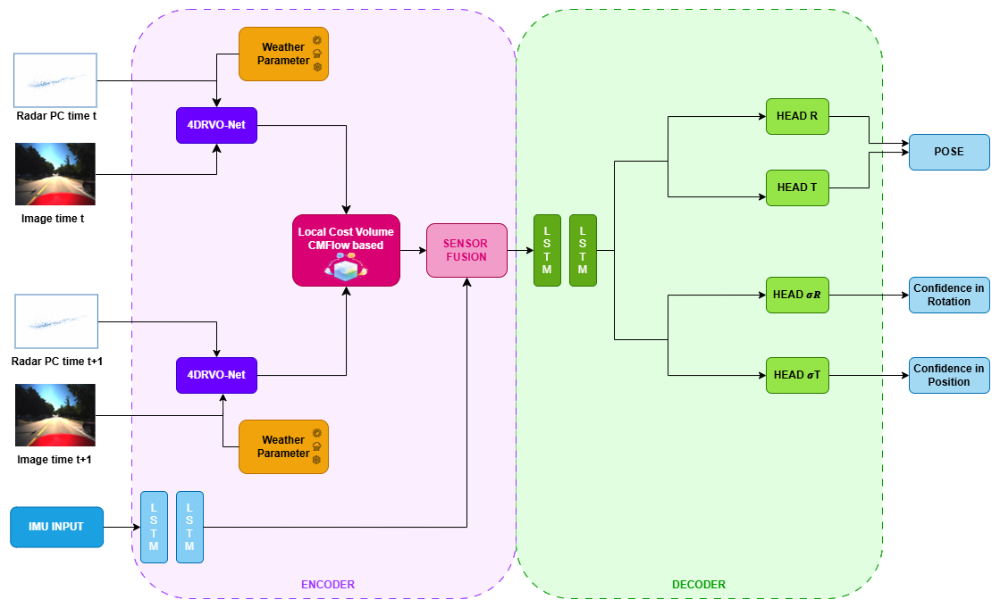
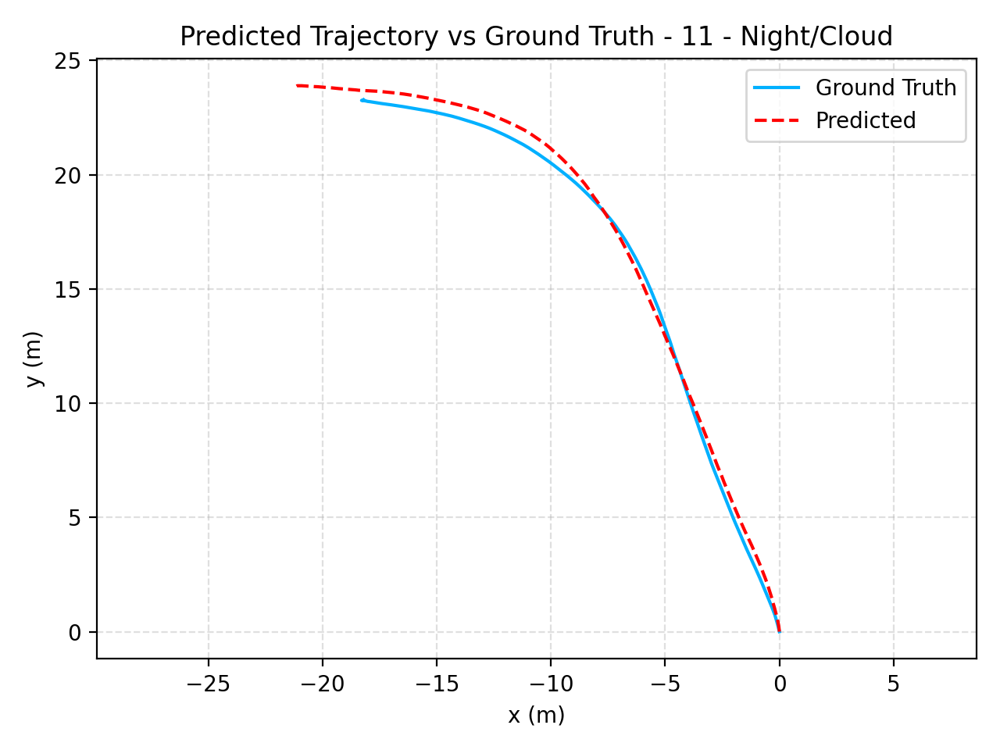
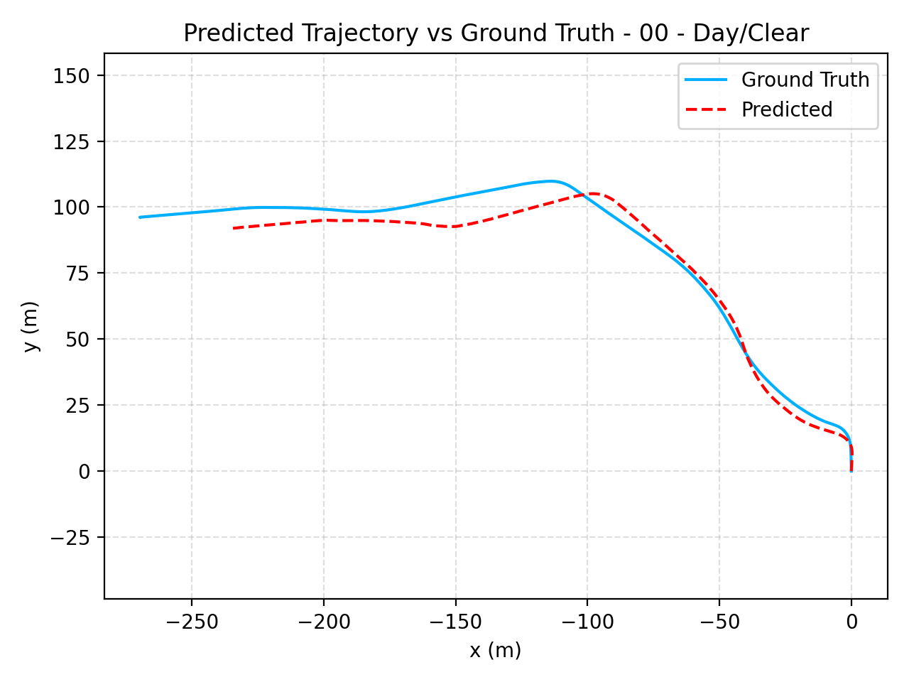
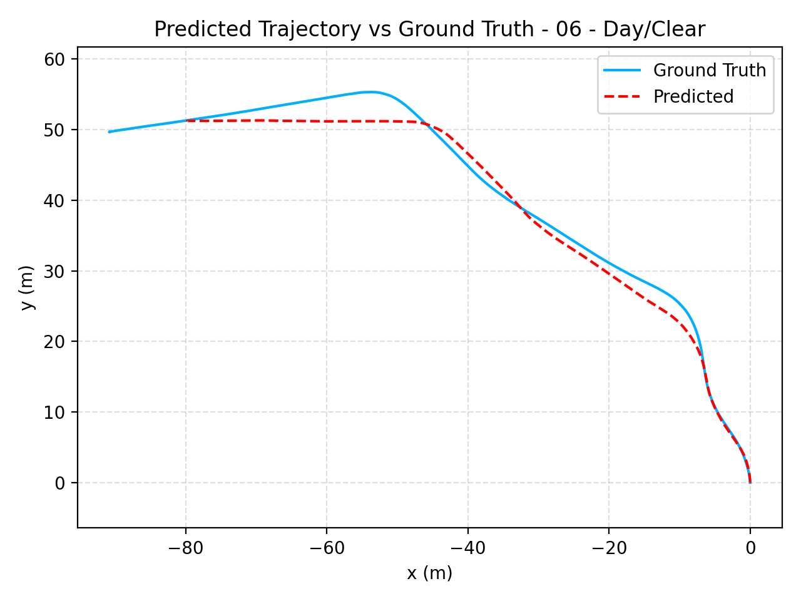
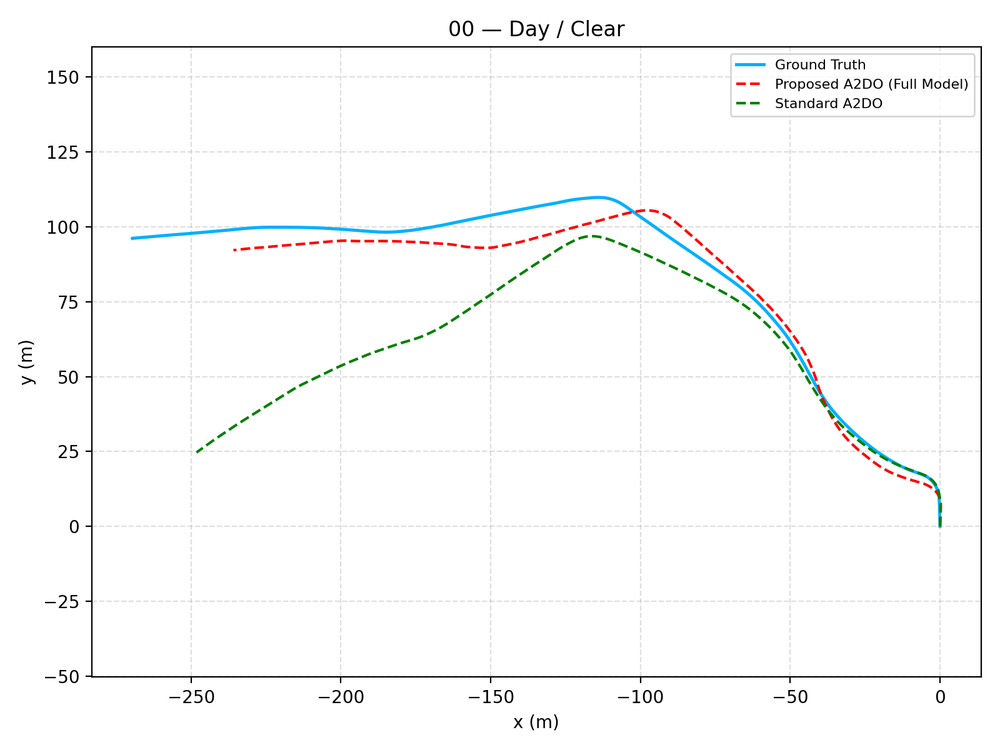
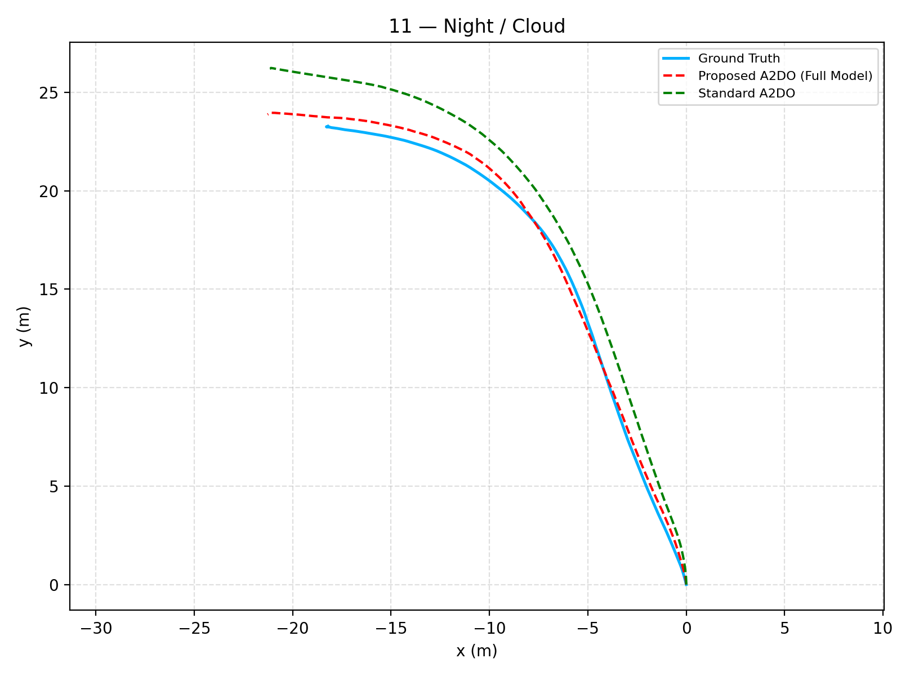
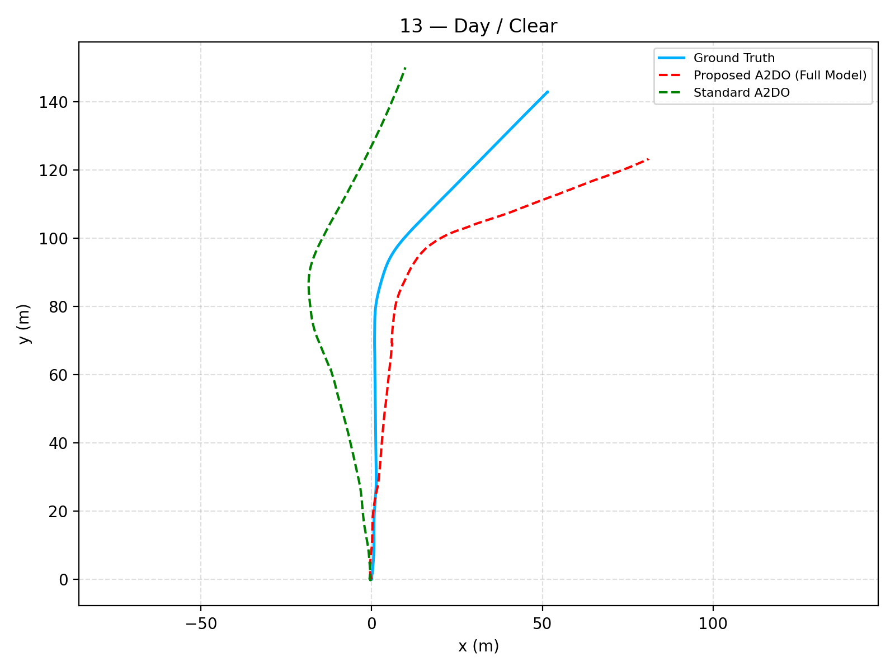

# AURORA: Adaptive Uncertainty-Aware Robust 4D Radar Fusion for All-Weather Multi-Modal Localization

## 📌 Overview

Reliable ego-vehicle localization is a fundamental requirement for autonomous driving, yet existing multi-modal systems often degrade under adverse weather and illumination conditions.

This repository contains the implementation of **AURORA**, an end-to-end multi-modal odometry framework designed to achieve robust localization by explicitly modeling environmental conditions and sensor reliability.

The framework integrates **4D radar, camera, and IMU data** within a unified architecture that dynamically adapts fusion strategies based on learned environmental degradation signals. 

---

## 🚀 Key Contributions

* **Environment-aware feature modulation**
  Explicit modeling of weather and illumination severity to dynamically adapt visual feature representations.

* **Policy-regularized soft-gated fusion**
  Continuous, reliability-aware multi-modal fusion that prevents degenerate modality selection.

* **Uncertainty-aware pose estimation**
  Joint regression of 6-DoF pose and heteroscedastic uncertainty for reliability-aware localization.

* **Robust performance in adverse conditions**
  Significant improvements in translational and rotational drift under challenging environments.

---

## 🧠 Method Overview

AURORA follows a multi-modal architecture based on three key principles:

1. **Modality complementarity** (camera, radar, IMU)
2. **Environment-conditioned feature modulation**
3. **Adaptive, policy-driven fusion**

### Architecture



The model extracts modality-specific features and dynamically modulates visual representations using learned environmental severity indicators. These features are fused through a policy-regularized mechanism and processed by a recurrent decoder for joint pose and uncertainty estimation.

---

## 📊 Results

The proposed framework achieves strong performance on the HeRCULES dataset:

* **ATE (Absolute Trajectory Error):** 2.04 m
* **RPE (translational):** 0.174 m/m
* **RPE (rotational):** 0.044 deg/m

Environment-aware modulation reduces:

* translational drift by **38.9%**
* rotational drift by **42.1%** 

### Trajectory Estimation

<p align="center">
  
  
  
</p>

<p align="center">
  Trajectories estimation across different scenarios.
</p>

### Comparison with A2DO

The proposed AURORA framework outperforms the A2DO baseline across all key odometry metrics.

- **ATE (Absolute Trajectory Error):** reduced from 4.28 m to 2.04 m (**52.3% improvement**)  
- **RPE (translational):** reduced from 0.299 m/m to 0.174 m/m (**41.8% improvement**)  
- **RPE (rotational):** reduced from 0.144 deg/m to 0.044 deg/m (**61.4% improvement**)  

These results highlight the effectiveness of modeling sensor reliability as a **continuous probabilistic process**, rather than relying on implicit or quasi-discrete attention-based fusion strategies.

<p align="center">
  
  
  
</p>

<p align="center">
  Qualitative comparison between A2DO and AURORA across representative sequences.
</p>

---

## 📁 Repository Structure

```text
AURORA/
├── README.md
├── .gitignore
├── requirements.txt
├── LICENSE
│
├── src/
│   ├── backbones/
│   ├── encoders/
│   ├── fusion/
│   ├── dataloaders/
│   ├── models/
│   └── utils/
│
├── scripts/
│
├── results/
│
└── docs/ 
```

---

## ⚙️ Installation

Clone the repository:

```bash
git clone https://github.com/alicedidomenico01/AURORA-Deep-Learning-Based-Localization.git
cd AURORA-Deep-Learning-Based-Localization
```

Install the main Python dependencies:

```bash
pip install -r requirements.txt
```

### PyTorch and GPU support

This project was developed and tested using PyTorch with CUDA 11.8:

```bash
pip install torch==2.1.2 torchvision==0.16.2 --index-url https://download.pytorch.org/whl/cu118
```

Other configurations may work, but have not been explicitly validated.

### Additional dependencies

Some components of the radar encoder rely on custom PointNet++ operators.
Their installation may require manual compilation depending on the system configuration (CUDA, compiler, and PyTorch version).

For reference, the implementation is based on:

https://github.com/erikwijmans/Pointnet2_PyTorch

> ⚠️ Note: Installation of custom CUDA operators may require a compatible GPU environment and is not strictly necessary for understanding the core structure of the framework.


---

## ▶️ Usage

Example training command:

```bash
python imu_seq2seq_lstm_radarstep_twohead_quat_adaloss_rmse_se3patch_inmodelenc_batched.py --mode train --seqs "00,01,02,03,04,05,06,07,08,09,10,11,12,13,15,16,18,20"
```

Example evaluation:

```bash
python imu_seq2seq_lstm_radarstep_twohead_quat_adaloss_rmse_se3patch_inmodelenc_batched.py --mode eval --seqs "00,01,02,03,04,05,06,07,08,09,10,11,12,13,15,16,18,20"
```

---

## 📄 Paper

The full paper describing AURORA will be available in this repository.


---

## 👤 Author

**Alice Di Domenico**

---


## 📚 References

This work builds upon several established methods in multi-modal odometry and deep learning:

- **A2DO**: Adaptive anti-degradation odometry with deep multi-sensor fusion for autonomous navigation  
- **4DRVO-NET**:Deep 4d radar–visual odometry using multi-modal and multi-scale adaptive fusion  
- **ResNet**: Deep residual networks for visual feature extraction  

We acknowledge these foundational works as key contributions to the development of the proposed AURORA framework.

---


## 📌 Notes

This repository focuses on research reproducibility and clean implementation of multi-modal sensor fusion for robust localization under environmental degradation.
